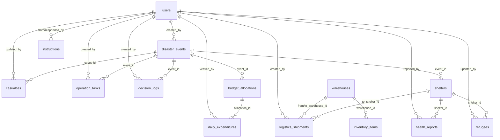

# 🗺️ Project Mapping — Dashboard Pimpinan BPBD Sulteng

> **Tujuan**: Pemetaan komprehensif seluruh fitur, halaman, relasi antar entitas, user roles, serta status data (dummy vs database live).
> **DB Snapshot**: 31 Maret 2026 09:20 WITA (dari TablePlus export)

---

## 1. Arsitektur Umum

| Layer | Stack |
|-------|-------|
| **Frontend** | React 19, Vite 7, Tailwind CSS v4, React Router v7, TanStack Query v5, Zustand, Recharts, React-Leaflet |
| **Backend** | Express 5, Sequelize 6, MySQL2, JWT (access+refresh), Helmet, CORS, Joi |
| **Database** | MySQL — `disaster_dashboard`, 14 tabel |
| **Auth** | JWT Access (15000m) + Refresh (7d), auto-refresh via axios interceptor |

> ✅ **Model ↔ DB Sync**: Semua 14 Sequelize model **sudah match 100%** dengan skema tabel MySQL aktual. Tidak ada field mismatch.

---

## 2. Sistem Role & Hak Akses (5 Level)

| # | Role | Level | Hak Akses |
|---|------|-------|-----------|
| 1 | `viewer` | 1 | Read-only semua halaman |
| 2 | `operator` | 2 | CRUD task, shipment, shelter, refugees; respond instruksi |
| 3 | `admin` | 3 | + CRUD event, decision, user, budget; akses Admin panel |
| 4 | `superadmin` | 4 | + delete user |
| 5 | `pimpinan` | 5 | Tertinggi — bisa buat instruksi |

**Implementasi**: Backend via `rbac.middleware.js`, Frontend via `usePermission()` hook + `ProtectedRoute`.

> ⚠️ **Catatan**: Sidebar "Pengaturan Master" hanya muncul untuk `admin/superadmin`. Role `pimpinan` tidak melihatnya.

---

## 3. Data Aktual di Database (Snapshot 31 Maret 2026)

### 3.1 Users — 8 akun

| ID | Nama | Email | Role | OPD | Aktif |
|----|------|-------|------|-----|-------|
| 1 | Super Administrator | superadmin@bpbd.go.id | `superadmin` | BPBD Provinsi | ✅ |
| 2 | Admin BPBD | admin@bpbd.go.id | `admin` | BPBD Provinsi | ✅ |
| 3 | Operator Lapangan | operator@bpbd.go.id | `operator` | BPBD Provinsi | ✅ |
| 4 | Super Administrator | superadmin@bpbd.sulteng.go.id | `superadmin` | BPBD Provinsi | ✅ |
| 5 | Admin BPBD | admin@bpbd.sulteng.go.id | `admin` | BPBD Provinsi | ✅ |
| 6 | Petugas Pusdalops | operator@bpbd.sulteng.go.id | `operator` | BPBD Provinsi | ✅ |
| 7 | Kalaksa BPBD | kalaksa@bpbd.sulteng.go.id | `pimpinan` | BPBD Provinsi | ✅ |
| 8 | Gubernur Sulawesi Tengah | gubernur@bpbd.sulteng.go.id | `pimpinan` | Pemprov Sulteng | ✅ |

> Password sama: `admin123` (bcrypt hash). User 1-3 dari seeder awal, User 4-8 ditambahkan kemudian.

### 3.2 Disaster Events — 8 kejadian

| ID | Judul | Jenis | Status | Severity | Lokasi | Koordinat | Posko Leader |
|----|-------|-------|--------|----------|--------|-----------|-------------|
| 1 | Banjir Bandang Kec. Suka Makmur | `banjir` | `tanggap_darurat` | `kritis` | Kec. Suka Makmur, Kab. A | -6.20, 106.80 | — |
| 2 | Tanah Longsor KM 42 | `longsor` | `tanggap_darurat` | `berat` | Jalur Lintas Selatan, KM 42 | -6.90, 107.60 | — |
| 3 | Banjir Rob | `lainnya` | `siaga` | `sedang` | Sigi Biromaru | NULL | — |
| 4 | Gempa | `gempa` | `siaga` | `sedang` | Toli-Toli | NULL | — |
| 5 | Banjir Bandang Sigi | `banjir` | `tanggap_darurat` | `kritis` | Kec. Dolo Selatan, Kab. Sigi | -1.09, 119.92 | tess ketau |
| 6 | Longsor Jalur Kebun Kopi | `longsor` | `tanggap_darurat` | `berat` | Jalur Trans Sulawesi | -0.74, 120.02 | — |
| 7 | Gempa M 6.2 Poso | `gempa` | `tanggap_darurat` | `kritis` | Poso Pesisir Utara | -1.35, 120.73 | — |
| 8 | Kebakaran Hutan Morowali | `karhutla` | `siaga` | `sedang` | Bungku Tengah, Kab. Morowali | -2.31, 121.72 | — |

> ⚠️ Event 1-2 memiliki koordinat Jakarta/Jabar (bukan Sulteng) — ini data seeder awal. Event 3-4 tidak punya koordinat (tidak tampil di peta). Event 5-8 sudah pakai koordinat Sulawesi Tengah yang benar.

### 3.3 Casualties — 5 record (terkait 5 event)

| ID | Event | Meninggal | Luka Berat | Luka Ringan | Hilang | Rusak Berat | Rusak Sedang | Rusak Ringan | Fasum Rusak | Jalan Putus |
|----|-------|-----------|------------|-------------|--------|-------------|-------------|-------------|-------------|-------------|
| 1 | #1 Banjir Suka Makmur | 8 | 24 | 60 | 3 | 120 | 200 | 130 | 15 | 6 |
| 2 | #2 Longsor KM42 | 4 | 10 | 24 | 2 | 0 | 0 | 0 | 0 | 2 |
| 3 | #5 Banjir Sigi | 2 | 14 | 45 | 1 | 45 | 120 | 80 | 4 | 2 |
| 4 | #7 Gempa Poso | 5 | 32 | 110 | 0 | 154 | 310 | 420 | 12 | 1 |
| 5 | #6 Longsor Kebun Kopi | 0 | 3 | 5 | 0 | 0 | 0 | 0 | 0 | 3 |

> Event #3 (Banjir Rob), #4 (Gempa Toli-Toli), #8 (Karhutla Morowali) **belum ada data korban**.

### 3.4 Shelters — 4 posko

| ID | Event | Nama Posko | Kapasitas | Terisi | Status | PIC |
|----|-------|-----------|-----------|--------|--------|-----|
| 1 | #1 | Posko GOR Bintang Gemilang | 1500 | 1250 | `aktif` | Kepala Dinas Sosial |
| 2 | #1 | Posko Desa Maju Sejahtera | 1000 | 850 | `aktif` | Kepala Desa |
| 3 | #5 | Posko Utama Dolo | 500 | 480 | `aktif` | Camat Dolo |
| 4 | #7 | Posko Alun-alun Poso | 2000 | 1540 | `aktif` | BPBD Poso |

> Hanya event #1, #5, #7 yang punya posko. Event lainnya **belum ada shelter**.

### 3.5 Refugees — 4 record (1 per shelter)

| ID | Shelter | Total Jiwa | Balita | Anak | Dewasa | Lansia | Ibu Hamil | Disabilitas |
|----|---------|-----------|--------|------|--------|--------|-----------|-------------|
| 1 | #1 GOR Bintang | 1250 | 188 | 313 | 625 | 125 | 22 | 15 |
| 2 | #2 Desa Maju | 850 | 127 | 213 | 425 | 85 | 14 | 10 |
| 3 | #3 Dolo | 480 | 65 | 120 | 250 | 45 | 8 | 4 |
| 4 | #4 Poso | 1540 | 210 | 400 | 750 | 180 | 25 | 18 |

**Total pengungsi: 4.120 jiwa**

### 3.6 Health Reports — 4 laporan

| ID | Shelter | Penyakit | Kasus | Severity | Catatan |
|----|---------|----------|-------|----------|---------|
| 1 | #1 GOR Bintang | ISPA | 142 | `sedang` | Perlu masker dan obat batuk |
| 2 | #1 GOR Bintang | Diare | 45 | `sedang` | Korelasi sanitasi kurang |
| 3 | #3 Dolo | Gatal-gatal | 85 | `ringan` | Kurang air bersih |
| 4 | #4 Poso | Diare | 112 | `sedang` | Sanitasi darurat penuh |

### 3.7 Warehouses — 3 gudang

| ID | Nama | Level | Lokasi | Koordinat | Kapasitas % | Status |
|----|------|-------|--------|-----------|-------------|--------|
| 1 | Gudang Provinsi (Utama) | `provinsi` | Kantor BPBD Provinsi | -6.20, 106.80 | 85% | `aktif` |
| 2 | Gudang Kab. A (Zona Merah) | `kabupaten` | Kabupaten A | -6.60, 107.20 | 92% | `aktif` |
| 3 | Gudang Bulog | `provinsi` | Palu | -0.90, NULL | 0% | `aktif` |

> ⚠️ Gudang 1-2 pakai koordinat Jakarta/Jabar (seeder). Gudang 3 longitude NULL (tidak bisa tampil di peta).

### 3.8 Inventory Items — 8 item

| ID | Gudang | Item | Stok | Unit | Konsumsi/hari | Min Threshold |
|----|--------|------|------|------|---------------|---------------|
| 1 | #1 Provinsi | Beras | 45 | Ton | 8 | 10 |
| 2 | #1 Provinsi | Air Bersih | 120 | KL | 40 | 40 |
| 3 | #1 Provinsi | Tenda | 350 | Unit | 120 | 50 |
| 4 | #1 Provinsi | Obat-obatan | 85 | Box | 15 | 10 |
| 5 | #2 Kab. A | Beras | 10 | Ton | 5 | 5 |
| 6 | #2 Kab. A | Air Bersih | 25 | KL | 20 | 20 |
| 7 | #2 Kab. A | Tenda | 120 | Unit | 30 | 20 |
| 8 | #3 Bulog | Beras | 10000 | Kg | 10 | 10 |

### 3.9 Logistics Shipments — 2 pengiriman

| ID | Kode | Dari | Ke | Kargo | Status | Driver | Plat |
|----|------|------|----|-------|--------|--------|------|
| 1 | TRK-8821 | Gudang Provinsi | Gudang Kab. A | Beras 5T, Air 10KL | `arrived` | Pak Budi | B 1234 CD |
| 2 | TRK-9004 | Gudang Kab. A | Posko GOR Bintang | Air 5KL, Beras 2T | `delayed` | Pak Andi | B 5678 EF |

> Pengiriman TRK-9004 tertunda: "Akses jalan terputus longsor di KM 12"

### 3.10 Operation Tasks — 11 task

| ID | Event | Judul | Prioritas | Status | OPD |
|----|-------|-------|-----------|--------|-----|
| 1 | #1 | Kirim alat berat ke Desa Suka Maju | `critical` | `in_progress` | Dinas PU |
| 2 | #1 | Distribusi air bersih ke Posko Utama A | `high` | `done` | BPBD |
| 3 | #1 | Evakuasi warga rentan di Zona Merah Banjir | `critical` | `done` | Basarnas |
| 4 | #2 | Pembersihan material longsor di KM 42 | `high` | `todo` | Dinas PU |
| 5 | #2 | Perbaikan Tiang Listrik Tumbang | `medium` | `in_progress` | PLN |
| 7 | NULL | Distribusi logistik PB | `high` | `done` | Fadhil |
| 8 | #5 | Distribusi Logistik Makanan Siap Saji Dolo | `high` | `in_progress` | Dinas Sosial |
| 9 | #5 | Pemasangan Jembatan Bailey Darurat Sigi | `critical` | `todo` | Dinas PU |
| 10 | #6 | Pembersihan Material Longsor Kebun Kopi | `critical` | `in_progress` | Balai Jalan |
| 11 | #7 | Asesmen Kerusakan Bangunan Poso Pesisir | `medium` | `todo` | BPBD M&E |
| 12 | #7 | Mendirikan Tenda Darurat RSUD Poso | `critical` | `done` | TNI/Polri |

> ID #6 tidak ada (gap). Task #7 punya `event_id = NULL`.
>
> **Ringkasan**: 3 todo, 4 in_progress, 4 done, 0 cancelled

### 3.11 Decision Logs — 4 keputusan

| ID | Event | Keputusan | Oleh | Tanggal |
|----|-------|-----------|------|---------|
| 1 | #1 | Pencairan BTT Tahap 1 Rp 12 Miliar | Gubernur | 03 Mar 2026 |
| 2 | #1 | Aktifkan TRC lintas OPD, status Tanggap 14 Hari | Kepala BPBD | 02 Mar 2026 |
| 3 | #7 | Status Tanggap Darurat Gempa Poso 14 Hari | Gubernur | 15 Mar 2026 |
| 4 | #6 | Instruksi alat berat ke Jalur Kebun Kopi | Kepala BPBD Provinsi | 17 Mar 2026 |

### 3.12 Budget Allocations — 9 alokasi

| ID | Event | Sumber | Sektor | Jumlah | Tanggal |
|----|-------|--------|--------|--------|---------|
| 1 | #1 | BTT | Logistik & Pangan | Rp 20 M | 03 Mar |
| 2 | #1 | BTT | Alat Berat & Evakuasi | Rp 15 M | 03 Mar |
| 3 | #7 | BTT | Logistik & Dapur Umum | Rp 5 M | 17 Mar |
| 4 | #5 | BTT | Sewa Alat Berat & Evakuasi | Rp 1.5 M | 17 Mar |
| 5 | #4 | BTT | Logistik dan evakuasi | Rp 500 Jt | 19 Mar |
| 6 | #3 | BTT | tess | Rp 1 M | 19 Mar |
| 7 | #5 | BTT | ttt | Rp 1 Jt | 19 Mar |
| 8 | NULL | BTT | uuuu | Rp 10 M | 27 Mar |
| 9 | NULL | BNPB | Dana Dari BNPD | Rp 100 M | 20 Mar |

> ⚠️ Alokasi #6-8 terlihat data tes (`tess`, `ttt`, `uuuu`). Alokasi #8-9 tidak terkait event (event_id NULL).
>
> **Total pagu**: Rp 153.001.000.000 (BTT: Rp 53.001.000.000 + BNPB: Rp 100.000.000.000)

### 3.13 Daily Expenditures — 7 pengeluaran

| ID | Alokasi | Tanggal | Jumlah | Deskripsi |
|----|---------|---------|--------|-----------|
| 1 | #1 (Logistik) | 03 Mar | Rp 3.5 M | Beras dan air bersih |
| 2 | #2 (Alat Berat) | 03 Mar | Rp 4.2 M | Sewa alat berat dan BBM |
| 3 | #3 (Poso) | 17 Mar | Rp 1.2 M | Logistik permakanan selimut Poso |
| 4 | #4 (Sigi) | 17 Mar | Rp 450 Jt | Operasional alat berat Sigi |
| 5 | #3 (Poso) | 18 Mar | Rp 1.2 M | Logistik permakanan selimut Poso |
| 6 | #4 (Sigi) | 18 Mar | Rp 450 Jt | Operasional alat berat Sigi |
| 7 | #9 (BNPB) | 20 Mar | Rp 10 M | Untuk makan sahurrrr |

> ⚠️ Pengeluaran #7 deskripsinya "Untuk makan sahurrrr" — data tes.
>
> **Total realisasi**: Rp 21.000.000.000

### 3.14 Instructions — 4 instruksi

| ID | Dari | Target Modul | Instruksi | Prioritas | Status |
|----|------|-------------|-----------|-----------|--------|
| 1 | #7 Kalaksa | `logistik` | Segera kirim bantuan ke Posko Sigi < 15.00 | `segera` | `selesai` |
| 2 | #8 Gubernur | `pengungsi` | Update data pengungsi saat ini | `penting` | `selesai` |
| 3 | #8 Gubernur | `peta` | Kenapa belum ada data bencana terbaru di parigi | `segera` | `selesai` |
| 4 | #8 Gubernur | `operasi` | Distribusikan bantuan air bersih ke pengungsian | `segera` | `baru` |

> Instruksi #2 punya response: "siap" (oleh Admin BPBD #2). Instruksi #4 masih `baru`.

---

## 4. Database Schema — 14 Tabel

### ER Diagram

### Detail Field Setiap Tabel

| Tabel | Field Kunci | Tipe Data Penting | Enum Values |
|-------|-------------|-------------------|-------------|
| **users** | name, email, password_hash, role, opd, is_active, last_login, refresh_token | role: ENUM | `superadmin, admin, operator, viewer, pimpinan` |
| **disaster_events** | title, type, status, severity, location_name, lat/lng, start_date, end_date, posko_leader, posko_leader_position, description, created_by | type: ENUM, status: ENUM, severity: ENUM | type: `banjir, longsor, gempa, karhutla, angin_kencang, lainnya` • status: `siaga, tanggap_darurat, pemulihan, selesai` • severity: `ringan, sedang, berat, kritis` |
| **casualties** | event_id, meninggal, luka_berat, luka_ringan, hilang, rumah_rusak_berat/sedang/ringan, fasilitas_publik_rusak, akses_jalan_putus, recorded_at, updated_by | semua INTEGER | — |
| **shelters** | event_id, name, location_name, lat/lng, capacity, current_occupancy, status, pic_name | status: ENUM | `aktif, penuh, tutup` |
| **refugees** | shelter_id, total_jiwa, balita, anak, dewasa, lansia, ibu_hamil, disabilitas, recorded_date, updated_by | semua INTEGER | — |
| **health_reports** | shelter_id, disease_name, case_count, severity, notes, reported_at, reported_by | severity: ENUM | `ringan, sedang, kritis` |
| **warehouses** | name, level, location_name, lat/lng, capacity_pct, status | level: ENUM, status: ENUM | level: `provinsi, kabupaten, kecamatan` • status: `aktif, tidak_aktif` |
| **inventory_items** | warehouse_id, category, item_name, unit, stock_quantity, daily_consumption, min_threshold | DECIMAL(10,2) | category validate: `logistik, peralatan, kendaraan` |
| **logistics_shipments** | shipment_code (UNIQUE), from_warehouse_id, to_warehouse_id, to_shelter_id, cargo_description, status, departure_time, eta, delay_reason, driver_name, vehicle_plate, created_by | status: ENUM | `preparing, in_transit, arrived, delayed, cancelled` |
| **operation_tasks** | event_id, title, description, priority, status, assigned_to_opd, estimated_hours, completed_at, created_by | priority: ENUM, status: ENUM | priority: `low, medium, high, critical` • status: `todo, in_progress, done, cancelled` |
| **decision_logs** | event_id, decision_text, decided_by (STRING, bukan FK), decided_at, created_by | — | — |
| **budget_allocations** | event_id, source, total_amount (BIGINT), sector, allocated_at | source: ENUM | `BTT, BNPB, Kemensos, Donasi, Lainnya` |
| **daily_expenditures** | allocation_id, expenditure_date, amount (BIGINT), description, verified_by | — | — |
| **instructions** | from_user_id, target_module, instruction_text, priority, status, assigned_to_role, response_text, responded_by, responded_at, completed_at | priority: ENUM, status: ENUM, target_module: ENUM | module: `dasbor, peta, operasi, logistik, pengungsi, anggaran` • priority: `biasa, penting, segera` • status: `baru, dibaca, dikerjakan, selesai` |

### FK & Cascade Rules

| FK | ON DELETE | ON UPDATE |
|----|-----------|-----------|
| casualties → disaster_events | CASCADE | CASCADE |
| casualties → users (updated_by) | SET NULL | CASCADE |
| shelters → disaster_events | CASCADE | CASCADE |
| refugees → shelters | CASCADE | CASCADE |
| health_reports → shelters | CASCADE | CASCADE |
| inventory_items → warehouses | CASCADE | CASCADE |
| logistics_shipments → warehouses | SET NULL | CASCADE |
| logistics_shipments → shelters | SET NULL | CASCADE |
| operation_tasks → disaster_events | SET NULL | CASCADE |
| decision_logs → disaster_events | SET NULL | CASCADE |
| budget_allocations → disaster_events | SET NULL | CASCADE |
| daily_expenditures → budget_allocations | CASCADE | CASCADE |
| instructions → users (from) | *(no delete)* | CASCADE |
| instructions → users (responded_by) | SET NULL | CASCADE |

> ⚠️ **Duplikat indexes**: Tabel `users` punya 19 UNIQUE KEY `email_*` dan `logistics_shipments` punya 19 UNIQUE KEY `shipment_code_*`. Ini kemungkinan dari `DB_SYNC_DEV=true` yang dijalankan berulang kali — tidak mempengaruhi fungsi tapi patut dibersihkan.

---

## 5. Peta Halaman & Routing

| Path | Halaman | Akses |
|------|---------|-------|
| `/login` | Login | Publik |
| `/` | Dasbor Utama (Executive) | Semua (protected) |
| `/map` | Peta Risiko & Dampak | Semua |
| `/ops` | Pusat Pengendalian (Kanban + Keputusan) | Semua (write: operator+) |
| `/logistics` | Logistik & Peralatan | Semua (write: operator+) |
| `/refugees` | Data Pengungsi | Semua (write: operator+) |
| `/funding` | Anggaran & Pendanaan | Semua |
| `/admin` | Pengaturan Master (7 tab CRUD) | admin+ |
| `/instruksi` | Log Instruksi Pimpinan | Semua |

### Komponen Layout Global

- **Sidebar** — navigasi + badge instruksi per modul
- **Topbar** — judul, jam live, toggle dark/light, nama user, logout
- **InstructionPanel** — panel floating (pimpinan: buat instruksi, operator: respond)

---

## 6. Detail Fitur per Halaman

### 6.1 Login
- Form email + password, show/hide toggle
- API: `POST /auth/login` → JWT tokens
- Demo hint: `admin@bpbd.go.id / admin123`

### 6.2 Dasbor Utama (`/`)
- **7 KPI cards** (kejadian aktif, meninggal/luka, pengungsi, rumah rusak, jalan putus, total anggaran, sisa dana)
- **Mini-map** Leaflet dengan markers event (severity color) + shelter
- **Top Prioritas** — tasks prioritas kritis/tinggi
- **Log Keputusan** — 5 keputusan terbaru
- **2 Charts** — bar (kejadian per jenis), pie (distribusi severity)
- **Progress penyerapan anggaran** (BTT)
- **Auto-refresh 30 detik**, global filter by event

### 6.3 Peta (`/map`)
- **Full-screen map** dengan 3 basemap (satelit, gelap, topografi)
- **Sidebar** daftar titik (searchable, filterable by layer + severity)
- **Detail panel** dan popup marker dengan info lengkap
- **Legenda** dan **stats bar** (kejadian, kritis, posko, pengungsi)

### 6.4 Pusat Pengendalian (`/ops`)
- **Kanban board** 3 kolom (Todo → On Going → Selesai)
- **Form tambah task** (judul, prioritas, PIC OPD, event ID)
- **Info Ketua Posko** (per event yang dipilih)
- **Tab Log Keputusan** — timeline vertikal + form catat keputusan
- Filter by event

### 6.5 Logistik (`/logistics`)
- **KPI** (total gudang, pengiriman aktif, tertahan)
- **Warehouse cards** + tabel inventaris (coverage days)
- **Daftar pengiriman** + advance status (Persiapan → Dalam Pengiriman → Tiba)

### 6.6 Data Pengungsi (`/refugees`)
- **KPI** (total pengungsi, posko aktif, kelompok rentan, kapasitas tersisa)
- **Charts**: distribusi per posko (bar), demografi rentan (pie)
- **Tabel posko** + occupancy progress bar

### 6.7 Anggaran (`/funding`)
- **KPI** (total pagu, realisasi, sisa saldo)
- **Filter sumber dana** (BTT/BNPB/Kemensos/Donasi/Lainnya)
- **3 Tab**: Grafik & Serapan, Alokasi Anggaran, Realisasi Pengeluaran
- Burn rate line chart, sektor breakdown

### 6.8 Pengaturan Master (`/admin`) — 7 Tab

| Tab | CRUD Target |
|-----|-------------|
| User | users (name, email, role, opd, aktif/nonaktif) |
| Kejadian | disaster_events (title, type, severity, status, posko_leader) |
| Operasi | operation_tasks |
| Logistik | warehouses, inventory_items, shipments |
| Pengungsi | shelters, refugees, health_reports |
| Pendanaan | budget_allocations, daily_expenditures |
| Keputusan | decision_logs |

### 6.9 Instruksi Pimpinan (`/instruksi`)
- **Statistik** (total, baru, dikerjakan, selesai)
- **Filter** by modul target + status
- **List InstructionCard** (reuse dari InstructionPanel)

---

## 7. Backend API Routes

Prefix: `/api/v1`

| Route | Module | Auth | RBAC |
|-------|--------|------|------|
| `/auth/*` | Login, Logout, Refresh, Me, ChangePassword | Partial | — |
| `/users/*` | CRUD User | ✅ | admin+ |
| `/events/*` | CRUD Event + GeoJSON | ✅ | varies |
| `/events/:id/casualties` | Upsert Casualties | ✅ | operator+ |
| `/warehouses/*` | CRUD Warehouse + Inventory | ✅ | varies |
| `/shipments/*` | CRUD Shipment | ✅ | varies |
| `/shelters/*` | CRUD Shelter | ✅ | varies |
| `/refugees/*` | Summary + CRUD per shelter | ✅ | varies |
| `/shelters/:id/health` | Health Reports | ✅ | varies |
| `/tasks/*` | CRUD Task | ✅ | operator+ |
| `/decisions/*` | CRUD Decision | ✅ | admin+ |
| `/instructions/*` | CRUD + Respond + Count | ✅ | varies |
| `/funding/*` | Summary, BurnRate, Allocations, Expenditures | ✅ | varies |
| `/dashboard/*` | KPI, Priorities, MapGeoJSON | ✅ | — |

---

## 8. ✅ Audit: Data Status

> **Semua halaman frontend sudah 100% terhubung ke backend API → MySQL database. Tidak ada data dummy di frontend.**

| # | Fitur | Status | Catatan |
|---|-------|--------|---------|
| 1 | Auth (Login/Logout/Refresh) | ✅ **LIVE** | JWT + bcrypt |
| 2 | Dashboard KPI | ✅ **LIVE** | Aggregasi multi-tabel |
| 3 | Dashboard Map GeoJSON | ✅ **LIVE** | Dari lat/lng events + shelters |
| 4 | Dashboard Priorities | ✅ **LIVE** | Filter critical/high tasks |
| 5 | Peta Interaktif | ✅ **LIVE** | 3 basemap, merge events + shelters |
| 6 | Kanban Tasks | ✅ **LIVE** | CRUD + status transition |
| 7 | Log Keputusan | ✅ **LIVE** | Timeline CRUD |
| 8 | Gudang & Inventaris | ✅ **LIVE** | Coverage days calc |
| 9 | Pengiriman Logistik | ✅ **LIVE** | Status tracking |
| 10 | Posko Pengungsian | ✅ **LIVE** | Occupancy tracking |
| 11 | Data Pengungsi Summary | ✅ **LIVE** | Agregasi demografi |
| 12 | Kesehatan | ✅ **LIVE** | Per penyakit per shelter |
| 13 | Korban (Casualties) | ✅ **LIVE** | Nested di event |
| 14 | Alokasi Anggaran | ✅ **LIVE** | Multi-source |
| 15 | Pengeluaran Harian | ✅ **LIVE** | Burn rate |
| 16 | Funding Summary | ✅ **LIVE** | Aggregation |
| 17 | Instruksi Pimpinan | ✅ **LIVE** | Full lifecycle |
| 18 | Badge Instruksi | ✅ **LIVE** | Count per module |
| 19 | Admin CRUD (semua tab) | ✅ **LIVE** | 7 tab, semua entitas |
| 20 | Dark/Light Theme | ✅ **LIVE** | localStorage |

---

## 9. Lintas-Halaman Dependencies

| Data | Dipakai Di |
|------|-----------|
| Active Events | ExecutivePage, OpsPage, AdminPage |
| Map GeoJSON | ExecutivePage (mini-map), MapPage (full) |
| Shelters | MapPage, RefugeesPage, AdminPage |
| Decisions | ExecutivePage, OpsPage, AdminPage |
| Funding Summary | ExecutivePage, FundingPage |
| Instruction Count | Sidebar badge, InstructionPanel |
| InstructionCard | InstructionPanel, InstructionLogPage |
| usePermission | OpsPage, LogisticsPage, RefugeesPage, AdminPage, InstructionLogPage |

---

## 10. Hardcoded Elements

| Elemen | Lokasi | Detail |
|--------|--------|--------|
| `STATUS: SIAGA` | Sidebar footer | Statis, tidak dari DB |
| `BPBD SULTENG` / `Command Center` | Sidebar, Login | Label statis |
| Map center `[-1.5, 121]` | ExecutivePage, MapPage | Koordinat default Sulteng |
| Sumber dana options | FundingPage | `['BTT', 'BNPB', 'Kemensos', 'Donasi', 'Lainnya']` |
| Event type labels | Multiple | `banjir, longsor, gempa, karhutla, angin_kencang, lainnya` |

---

## 11. ⚠️ Temuan & Potensi Isu

### Kualitas Data

| Isu | Detail |
|-----|--------|
| **Koordinat seeder salah** | Event #1-2 dan Warehouse #1-2 pakai koordinat Jakarta/Jabar, bukan Sulteng |
| **Data tes tercampur** | Budget alokasi `tess`, `ttt`, `uuuu` dan expenditure `Untuk makan sahurrrr` |
| **Event tanpa koordinat** | Event #3, #4 (lat/lng NULL) — tidak tampil di peta |
| **Warehouse tanpa longitude** | Gudang #3 Bulog punya latitude tapi longitude NULL |
| **Event tanpa shelter** | Event #2, #3, #4, #6, #8 belum punya posko |
| **Event tanpa casualty** | Event #3, #4, #8 belum ada data korban |
| **Budget tanpa event** | Alokasi #8, #9 punya event_id NULL |
| **Task tanpa event** | Task #7 punya event_id NULL |
| **Posko leader mismatch** | Event #5 punya `posko_leader = 'tess ketau'` — data tes |

### Teknis

| Isu | Detail |
|-----|--------|
| **Duplikat unique indexes** | `users.email` dan `shipments.shipment_code` punya 19 duplicate UNIQUE KEY — dari `DB_SYNC_DEV` berulang |
| **Role pimpinan tanpa Admin** | Sidebar cek `admin \|\| superadmin`, pimpinan tidak bisa akses panel Admin |
| **Sidebar "SIAGA" hardcoded** | Status tidak berubah sesuai event aktif |
| **Admin tab files besar** | 13-39KB per file, perlu audit apakah semua CRUD path berfungsi |
| **Tidak ada pagination** | Beberapa list (shipments, shelters, funding) tanpa paginasi |
| **Tidak ada export** | Belum ada fitur PDF/Excel report |
| **Validasi form minimal** | Kebanyakan hanya HTML `required` |
| **`DB_SYNC_DEV=false`** | Model sync OFF — perlu migration manual jika schema berubah |

### ✅ Hal Yang Sudah Baik

1. **100% data dari database** — tidak ada dummy data di frontend
2. **Model ↔ DB sinkron** — semua 14 Sequelize model match persis dengan skema MySQL aktual
3. **Full CRUD** di Admin panel untuk semua entitas
4. **Auto-refresh 30s** untuk monitoring real-time
5. **JWT refresh token** dengan auto-retry queue di axios interceptor
6. **RBAC konsisten** di frontend (hook) dan backend (middleware)
7. **Instruksi Pimpinan** terintegrasi penuh (buat, track, respond, badge)
8. **Dark/Light theme** dengan persistence
9. **FK cascade rules** yang tepat (delete event → cascade shelters → cascade refugees)
